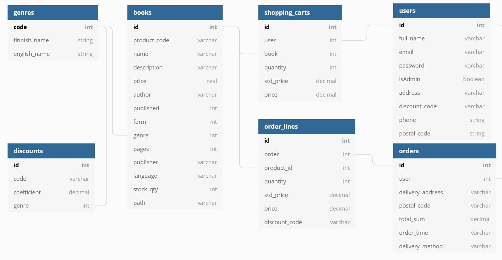

# AuraKirjat 1.0

(NOTE: This application has so far user interface only in finnish. But you can find a description about the application in english here in same repository from file README_eng.md.)

AuraKirjat on [Buutti Educationin järjestämässä TypeScript-koulutuksessa](https://buuttiedu.com/tyonhakijalle/buutcamp-sprint-typescript/) ryhmätyönä (Scrum) toteutettu kirjojen verkkokauppasovellus. 

## AuraKirjat-sovelluksen toiminnallisuudet:

Käyttäjä voi selailla sovelluksessa myytävänä olevia kirjoja ilman sovellukseen rekisteröitymistä / kirjautumista.

Sovelluksessa kirjat ovat selailtavissa tyylilajeittain (genreittäin), jotka näkyvät sovelluksen vasemmassa laidassa.
Kirjoja voi myös hakea ruudun yläosassa näkyvään “Hae kirjan tai tekijän mukaan” -hakuikkunaan kirjan tai tekijän nimen joko kokonaan tai osittain, jolloin sovellus näyttää kaikki annetulla merkkiyhdistelmällä löytyvät kirjat.

### Rekisteröityminen / kirjautuminen:

Käyttäjän halutessa tilata sovelluksessa myytävänä olevia kirjoja, on hänen ensin rekisteröidyttävä sovelluksen käyttäjäksi antamalla nimi, sähköpostiosoite käyttäjätunnukseksi ja vapaavalintainen, vähintään viisi merkkiä sisältävä, salasana.

Tämän jälkeen käyttäjän pitää kirjautua järjestelmään edellä antamillaan sähköpostiosoitteella ja salasanalla, jotta hän pääsee tilaamaan kirjoja.

Profiili-kuvakkeesta käyttäjä pääsee katsomaan ja ylläpitämään omia tietojansa.
Samoin näkemään oman tilaushistoriansa.

### Kirjojen tilaaminen:

Kirjan kohdalta löytyvällä “Lisää ostoskoriin” -painikkeella käyttäjä pystyy lisäämään kirjoja omaan ostoskoriinsa. Ostoskorin sisältö ilmestyy näkyviin ruudun oikeasta laidasta joka kerta, kun ostoskoriin lisätään kirjoja.
Ostoskorissa olevia kirjoja voi poistaa siellä olevalla roskakori-kuvakkeella.

Käyttäjän saatua poimittua haluamansa kirjat ostoskoriin, jossa olevaa “Kassalle” -painiketta painamalla sovellus siirtyy sivulle, jossa käyttäjä saa syöttää toimitusosoitteen postinumeroineen. Tämän jälkeen tilauksen voi lähettää “TILAA”-painikkeella verkkokaupalle toimituskäsittelyyn.

### Uloskirjautuminen:

Sovelluksesta uloskirjautuminen tapahtuu “Kirjaudu ulos” -painikkeella.

## AuraKirjat - ohjelmointiteknologiat:

Ohjelmointikieli:
TypeScript

Käyttöliittymäkirjasto:
React

Käyttöliittymän tyylien määrittely:
CSS

Runtime-ympäristö:
Node.js

Tietokanta:
PostgreSQL
pgAdmin

Tietokannan käsittely ohjelmassa:
TypeORM

Tietokannan kuvaus:
dbdiagram.io

Ohjelmiston kehitystyökalut:
Visual Studio Code
ESLint

Versionhallinta:
Git(Lab)

## AuraKirjat - sovelluksen asentaminen:

Sovelluksen lähdekoodi voidaan kopioida GitLab:sta (polku tulee muuttumaan).
https://gitlab.com/buutcampsprint/typescript2020/project-yellow

Tämän jälkeen luodaan itse sovellus ajamalla npm install -komennot projektin alahakemistoissa /server ja /client

## AuraKirjat - sovelluksen käynnistäminen:

Server-hakemistossa:
npm run watch

Client-hakemistossa:
npm start

## Jatkokehitystarpeita:

Alennuskoodin käsittely kassatoiminnoissa.

Admin-toimintoja: kirjojen, genrejen ja alennuskoodien ylläpitotoiminnot käyttöliittymän kautta.

Kirjan myytävissä olevan saldon tarkistus tilauksen teon yhteydessä.
Kirjan saldon muutos tilauksen hyväksymisessä.

Tarjotaaan sisäänkirjautumattomallekin käyttäjälle mahdollisuus lisätä tuotteita ostoskoriin.

Englannin kielinen käyttöliittymä.
